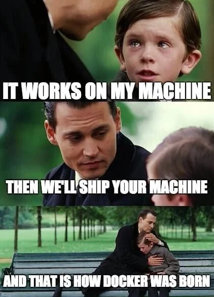

# Primer to Docker

### Target audience
* Need to replicate/transfer enivronments across multiple machines (same architecture)
* Need to work with different CUDA versions
* Want to work in a environments that do not affect each other, but hate conda

Technically conda works too, but I often encounter conda freezing/taking too long to install packages. 
I also often find myself using the wrong opencv/pytorch/numpy version far too often, despite using conda environments.
I rarely encounter this with docker. Also, I doubt conda can export an environment for another machine with no internet access.

If conda/virtual env works for you, by all means, continue to use it. 
Learning a new tool takes effort. This effort might be better used elsewhere.

But if all of the above is foreign to you and you're a software engineer, I would strongly suggest for you to at least pickup conda/venv. 
Else you might end up in dependency hell. (google if you need to know the difference between container and image, and docker and virtual machine)

### Introduction

I like docker because it makes it very convenient for someone else to run your code.
Someone else does not need to go through depedency hell to get your code to work, they just need to get docker working and get the image.
To me docker provides a nice fixed environment where code will run.



To give an analogy, container is like a virtual machine, and image is like the virtual machine disk. 
In very layman terms, image is like some harddisk in your computer, that has everything installed
Whereas a container is like the computer that requires the hard disk so that it can launch the stuff you want to work with.

My analogy might suck, and if you still dont understand, I hope the example of building an image and getting a container to run helps you to understand better.


The by right way of building an image is to use a dockerfile. This dockerfile is the reciple/blueprint/instruction to build the docker image.
With an image, you then run a container based on that image. 


### Example
Docker requires less effort, not no effort. So we still need to put in some effort to learn how to have a nice "portable" environment.

Let's try to solve a real problem and get a container that can run [Superpoint](https://github.com/magicleap/SuperPointPretrainedNetwork).

Assumption: we are using docker with a good enough gpu + nvidia driver (+ linux kernel > 3.10)
First install [nvidia-docker2](https://docs.nvidia.com/datacenter/cloud-native/container-toolkit/install-guide.html#setting-up-docker)

Get the required files for this example
```
git clone https://github.com/ablyx/detection.git
```
Use `docker images` to see what images you have. 

Build the image (the -t param is the tag/name you give your image)
```
docker build -f DOCKERFILE -t detection:1.0 .
```
You should now see your image in `docker images`

Use `docker ps -a` to see all the containers you have. Without the `-a` flag, you will only see the running containers. 

Get a shell (Like ssh into a computer with all the dependencies installed). 
-v mounts folder, can be used the mount the folder of code to run. 
The reason why you get a shell is because of -it (interactive). Without -it, your container will just run in the background. 
And when you exit from your container, it will be removed due to the --rm flag. 
Without the --rm flag, the container will be stopped and you will not be able to create another container with the same name.
--name is the name of the container, which will be used in other docker commands. Without this flag, docker will give your container a random name.
```
docker run -it --rm --gpus=all --name=superpoint  -v /path/to/detection:/detection -e NVIDIA_DRIVER_CAPABILITIES=video,compute,utility detection:1.0
```
You are now inside the container, in the directory specified by WORKDIR in the dockerfile.
You should be able to see the container by running `docker ps -a` in another terminal.
To get to the folder that you mounted onto the container
```
cd /detection
```
You can also get another shell to this container 
```
docker exec -it superpoint bash
```

To change the workdir to the folder that you mount, use the -w flag

```
docker run -it --rm --gpus=all --name=superpoint  -v /path/to/detection:/detection -w /detection -e NVIDIA_DRIVER_CAPABILITIES=video,compute,utility detection:1.0
```

I usually mount my code in the container (so container only contains environment, no source code) and run it in the container.
An alternative is to build the image with the code inside it, this way you won't have to mount anything. However, this will mean that everytime you update your code, you have to rebuild the image, which is a huge hassle.

### Updating docker image
If you have new dependencies to add/change certain environment variables, you should update the image. 
You can edit the dockerfile and build a new image
```
docker build -f DOCKERFILE -t detection:2.0 .
```

Alternatively, you can run the container and make the changes required. Then commit the container to a new image
```
docker commit superpoint detection:2.0
```
I try to avoid this method as you lose track of the steps required to build the image. 

### 
Another way to use the container is to get a command to run in the container. This command will be run in container, in the folder specified by WORKDIR in the DOCKERFILE used to create the image. This folder is where you are when you run with -it.
```
docker run --gpus=all --name=superpoint -v /path/to/detection:/detection -w /detection -e NVIDIA_DRIVER_CAPABILITIES=video,compute,utility  detection:1.0 python3.7 show_points.py --memefolder memes --write_dir test .
```
This can open up a can of worms if you are new to docker.

You can save the image to a tar folder, then transfer the image to another machine and load it.
This way, you dont have to reinstall the required dependencies for your project when you work on multiple machines/pass people code.
```
docker save detection:1.0 -o detection.tar
docker load -i detection.tar
```
There are more stuff that you can do with docker, and that will be left as an exercise to you.

For serious "production" level stuff like restarting containers upon failure or restarting containers when image is updated, do consider kubernetes.
